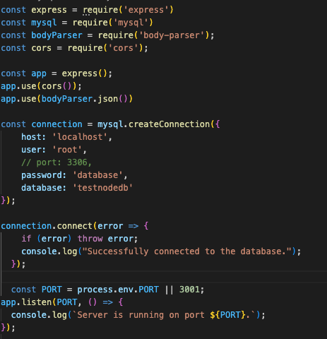
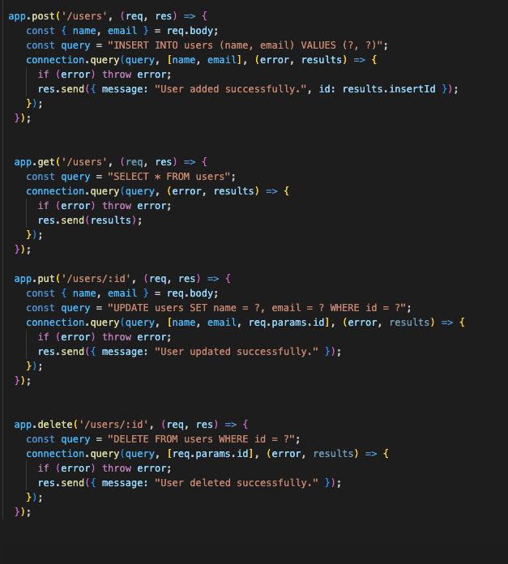
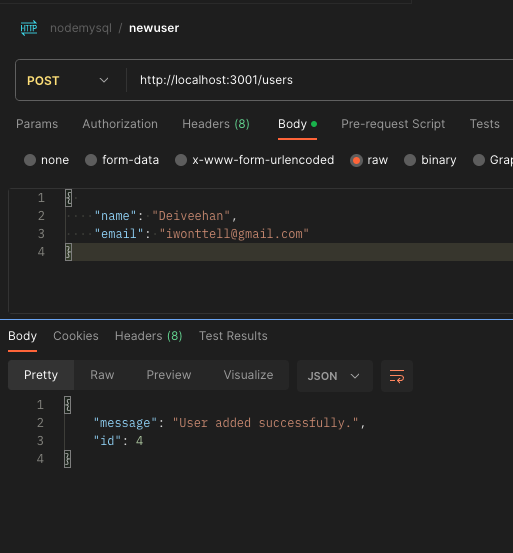
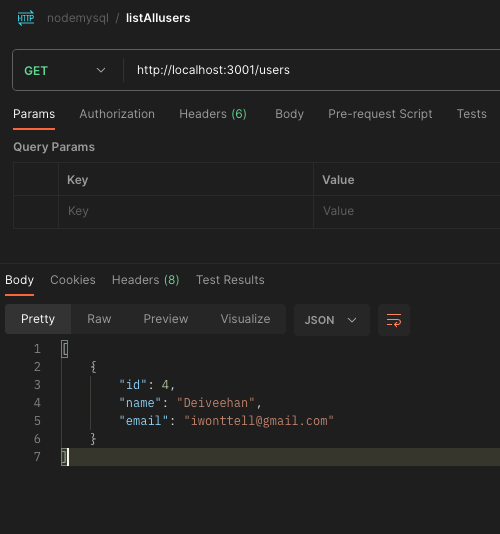

## Connecting to mysql backend using Node

## Prerequisites
Node.js and npm (Node package manager) installed.
MySQL installed and running on your machine.

- Install required packages:
```shell
npm install express mysql cors body-parser


```

## Install mysql
```shell
brew install mysql
mysql -u root -p

CREATE DATABASE testnodedb;
USE testnodedb;

CREATE TABLE users (
  id INT AUTO_INCREMENT PRIMARY KEY,
  name VARCHAR(255),
  email VARCHAR(255)
);

```

## Connect to backend using nodejs


## Create required CRUD endpoints



## Run the server. 
```shell
Add the following to package.json
    "start": "node index.js",

npm start
```

## Test in POSTMAN:

Create new user:


View all users:
